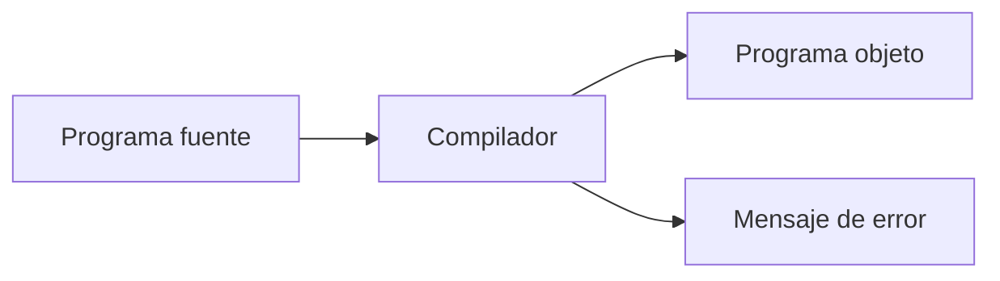

# Compiladores
## Teoría de compiladores
Programa que lee un programa funte y lo traduce a lenguaje objeto. Como parte de este proceso el compilador informa de la presencia de errores.

### Programa Fuente
Código escrito en alto nivel, el cual permite al programador, no solo reutilizar variables, sino la utilización de comentarios, identación, uso de estructuras de código, funciones que ayudan a la reutilización de código.

### Programa Objeto

