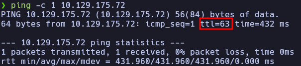
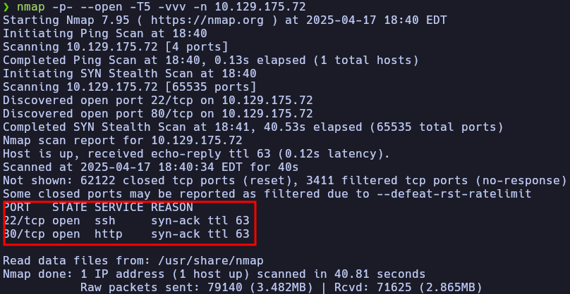
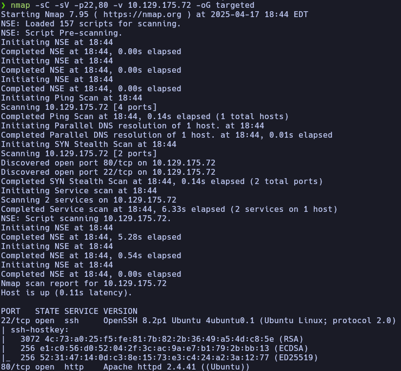
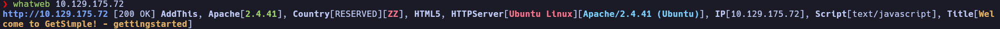
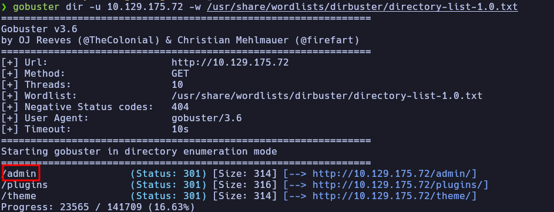
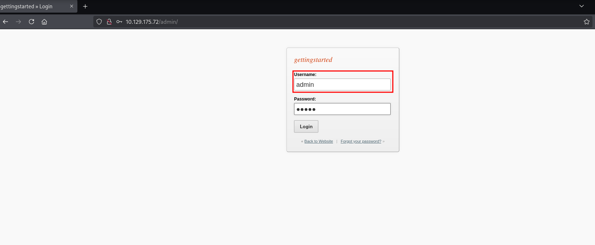
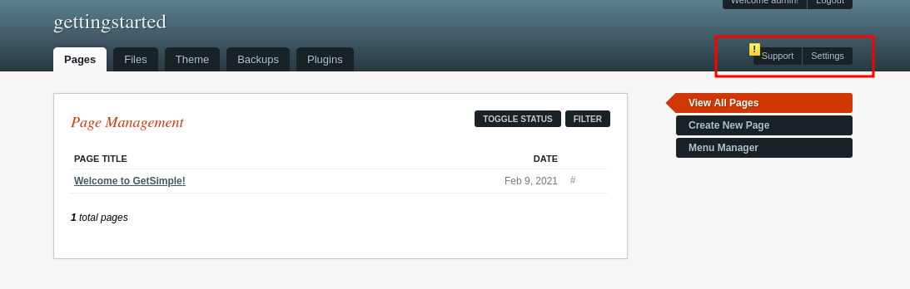
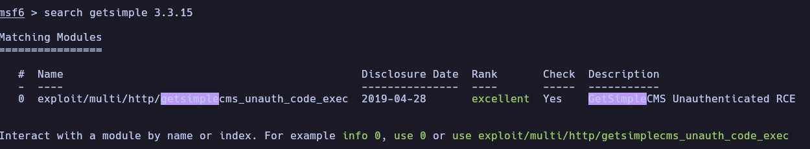
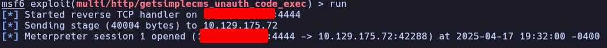
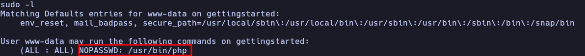

## Enumeration 
First to know about the operating system of the machine I performed a ping, with this tool by the `ttl` we can get the type of operating system

Now we know we are dealing with a UNIX machine. After this, we will try to enumerate the services running on the host. Let's try using nmap.

With this scan we are searching to filter any open port on the machine, but wanting to avoid raising alarms, for this reason we are avoiding looking for the version of any closed or filtered port. Now we will make and specialized enumeration on the open port

Later, as we have a http server running on 80 we should try entering to the web server by our browser. While we are looking for more information in the web page, I will start a brute force scanning searching for hidden but open files or directory with `gobuster`. Obviously, after an already make what web

After the `gobuster` finished we see an interesting page in our machine

Obviously we entered to this page and tried common credentials in this case `admin:admin`, the we have access to the dashboard

## Exploitation 
**Using Metasploit Framework**:
1. search for the `getsimple 3.3.15`

2. configure and run the exploit

3. get a shell
4. enter `python3 -c 'import pty; pty.spawn("/bin/bash")'` to get a pseudo TTY
5. execute `sudo -l`

6. As www-data we can execute the php binary so lets try getting a root shell with this by running `sudo /usr/bin/php -r 'pcntl_exec("/bin/bash")'`
7. search for the flags
